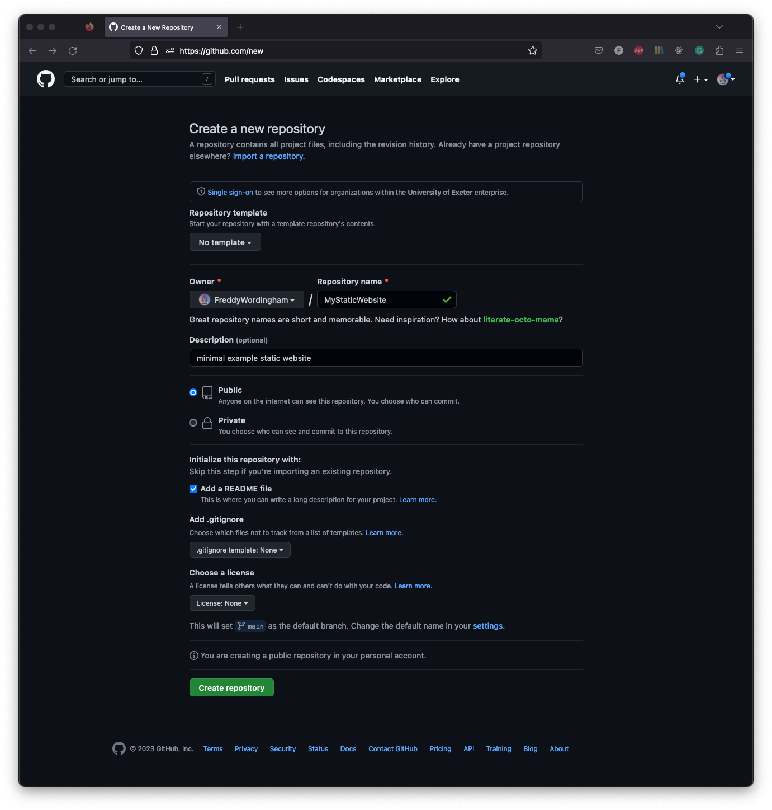
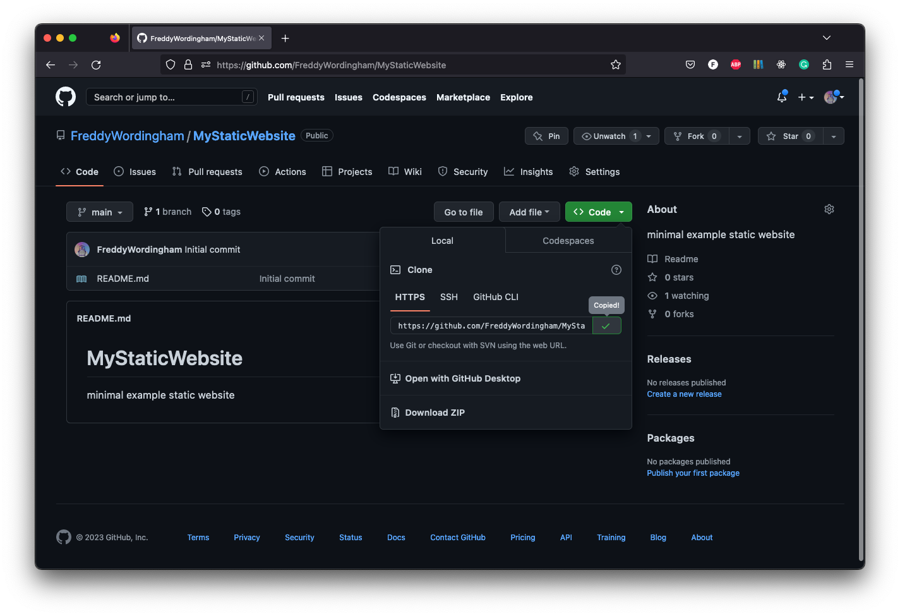
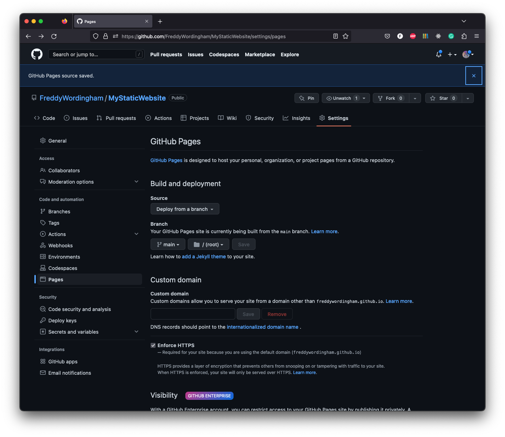

# GitHub Pages - Hosting

GitHub Pages essentially allows us to view our git repository as a website.
This is a free service provided by GitHub.
It allows us to host our static website on the internet, for free.

## Setup

To setup GitHub Pages, we need to create a new repository at https://github.com/new:



We can choose any name we like for the repository.

Next we want to copy the URL of the repository.
This is revealed by the green box "<> Code" button on the right hand side of the page:



Then we want to clone the repository to our local machine.
In the terminal we run the command:

```shell
git clone https://github.com/FreddyWordingham/MyStaticWebsite.git
```

And then change into the directory:

```shell
cd MyStaticWebsite
```

We're going to need an `index.html`, `style.css`, and `script.js` file:

```shell
touch index.html style.css script.js
```

Put what you like in these files!
They'll be the files that are served as the website when we host it.

## Track Changes

To host our website, we need to push our changes to GitHub.

First, add all the files we want to track using git:

```shell
git add .
```

Note that here we are adding all files in the current directory using the `.` to indicate everything in the current directory:

```shell
git commit -m "Initial commit"
```

Finally, we push our changes to GitHub:

```shell
git push
```

## Hosting

Back on GitHub.com, go to the `settings` tab of the repository, and then to the `pages` tab on the left hand side:



We'll publish from the `main` branch and (as our `index.html` file is in the top-level directory of our project) the `root` folder.

After a few minutes, our website will be hosted at something similar to https://FreddyWordingham.github.io/MyStaticWebsite/.
